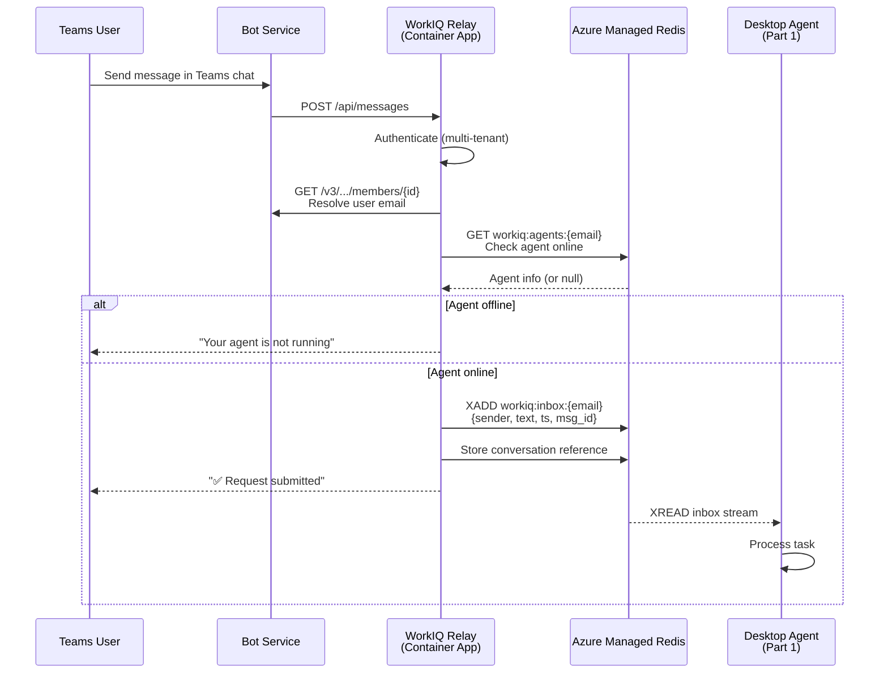
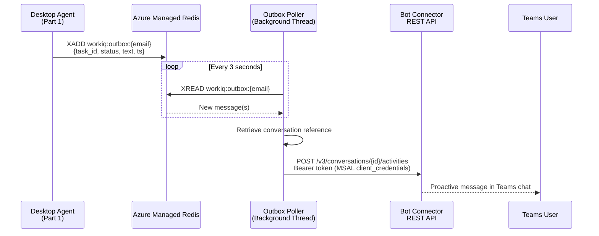
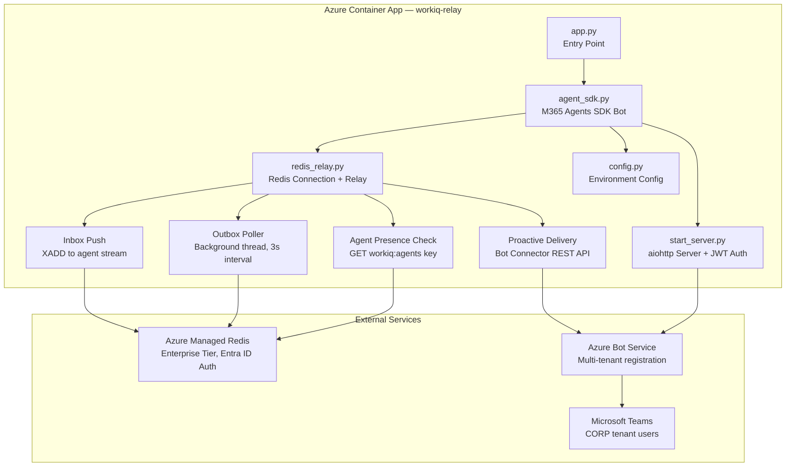

# WorkIQ Remote Client — Teams Channel Interface for Desktop Agents

> **Part 2 of 2** — This is the remote Teams-based interface for the WorkIQ desktop agent system.
> Part 1 (the desktop agent) is available here: [WorkIQ-MeetingInvite-Agent](https://github.com/MSFT-Innovation-Hub-India/WorkIQ-MeetingInvite-Agent)

## Overview

WorkIQ Remote Client is a **Microsoft Teams bot** that gives users a **remote channel-based interface** to interact with their personal WorkIQ Agent running on their desktop computer — from anywhere, on any device, through Microsoft Teams.

Users can send natural-language requests to their desktop agent via Teams chat, and receive the agent's responses back in the same conversation — even when they're away from their desk. The bot acts as a lightweight relay, bridging the Teams channel to the desktop agent through Azure Managed Redis streams.

### What Can Users Do?

- **Send task requests** to the remote desktop agent from Teams (e.g., "Check my emails from the last 3 days and tell me what's waiting for me")
- **Receive responses** from the agent pushed back to Teams once the task is complete
- **Enquire about the request queue** — ask the agent how many requests are queued, what's currently being processed, and what step the agent is on
- **Get status updates** on in-flight tasks, including progress indicators and completion notifications

---

## Architecture

### High-Level Architecture

```
┌─────────────────────────────────────────────────────────────────────────┐
│                          CORP Tenant (Microsoft)                        │
│                                                                         │
│   ┌──────────────┐          ┌───────────────────┐                       │
│   │  Teams User  │◄────────│ Azure Bot Service  │                       │
│   │  (Desktop/   │ Display │  (Bot Channel)     │                       │
│   │   Mobile)    │ message │                    │                       │
│   └──────┬───────┘         └─────────┬──────────┘                       │
│          │                       ▲   │                                  │
│          │ User Message          │   │ Inbound POST                     │
│          └───────────────────────┘   │ /api/messages                    │
└──────────────────────────────────────┼──────────────────────────────────┘
                                       │
┌──────────────────────────────────────┼──────────────────────────────────┐
│                    FDPO Tenant (Azure Resources)                        │
│                                      │                                  │
│                           ┌──────────▼───────────┐                      │
│                           │  Azure Container App │                      │
│                           │  (workiq-relay bot)  │                      │
│                           │                      │                      │
│                           │  • M365 Agents SDK   │                      │
│                           │  • Redis Relay       │                      │
│                           │  • Outbox Poller ────┼──┐                   │
│                           └──────────┬───────────┘  │                   │
│                                      │              │ Proactive message │
│                                      │              │ POST /v3/conver-  │
│                                      │              │ sations/{id}/     │
│                                      │              │ activities        │
│                                      │              │ (Bot Connector    │
│                                      │              │  REST API)        │
│                                      │              │                   │
│            ┌─────────────────────────┘              │                   │
│            │                                        │                   │
│            ▼                                        │                   │
│ ┌──────────────────────────┐                        │                   │
│ │  Azure Managed Redis     │                        │                   │
│ │  (Enterprise Tier)       │                        │                   │
│ │                          │   Agent writes ──►     │                   │
│ │  • workiq:inbox:{email}  │   outbox stream        │                   │
│ │  • workiq:outbox:{email} │──────────────────►─────┘                   │
│ │  • workiq:agents:{email} │   Poller reads                             │
│ └──────────┬───────────────┘   new messages                             │
│            │                                                            │
└────────────┼────────────────────────────────────────────────────────────┘
             │
  ┌──────────▼────────────────┐
  │  User's Desktop PC        │
  │  (Windows 11)             │
  │                           │
  │  WorkIQ Desktop Agent     │
  │  (Part 1 of solution)     │
  │  • Reads inbox stream     │
  │  • Processes task         │
  │  • Writes result to       │
  │    outbox stream          │
  └───────────────────────────┘
```

### Message Flow — Request Path (Teams → Desktop Agent)



### Message Flow — Response Path (Desktop Agent → Teams)



### Component Design



---

## Multi-Tenant Architecture

This solution operates across two Entra ID tenants:

| Tenant | Role | ID |
|--------|------|----|
| **FDPO** | Hosts all Azure resources (Container App, Redis, ACR, Bot Registration) | `16b3c013-d300-468d-ac64-7eda0820b6d3` |
| **CORP** | Where Teams users reside and interact with the bot | `72f988bf-86f1-41af-91ab-2d7cd011db47` |

The bot app registration is of **multi-tenant** type, registered in the FDPO tenant but authorized to accept messages from CORP tenant Teams users. Proactive messaging tokens are acquired against the FDPO tenant using client credentials (CORP tenant blocks `client_credentials` grants via Conditional Access policies).

---

## Redis Stream Schema

All keys are namespaced by user email (lowercased):

| Key Pattern | Type | Purpose |
|---|---|---|
| `workiq:agents:{email}` | String (JSON + TTL) | Agent presence — desktop agent heartbeat |
| `workiq:inbox:{email}` | Stream | Messages from Teams user → desktop agent |
| `workiq:outbox:{email}` | Stream | Responses from desktop agent → Teams user |

### Inbox Stream Fields

| Field | Description |
|-------|-------------|
| `sender` | Display name of the Teams user |
| `text` | The user's message text |
| `ts` | Unix timestamp |
| `msg_id` | Unique message identifier |

### Outbox Stream Fields

| Field | Description |
|-------|-------------|
| `task_id` | Task identifier from the agent |
| `status` | `completed`, `failed`, `in_progress` |
| `text` | Response text from the agent |
| `ts` | Unix timestamp |
| `in_reply_to` | Original `msg_id` this responds to |

---

## Project Structure

```
workiq-agent-remote-client/
├── app.py                  # Entry point — calls agent_sdk.main()
├── agent_sdk.py            # M365 Agents SDK bot — message handler, auth, email resolution
├── redis_relay.py          # Redis connection, inbox push, outbox polling, proactive delivery
├── start_server.py         # aiohttp server with /api/messages and /health endpoints
├── config.py               # Environment variable configuration
├── Dockerfile              # Python 3.12-slim container image
├── requirements.txt        # Python dependencies
├── .env.example            # Template for environment variables
├── appPackage/
│   ├── manifest.json       # Teams bot manifest (v1.16, personal scope)
│   ├── color.png           # Bot icon (192x192)
│   └── outline.png         # Bot outline icon (32x32)
└── README.md               # This file
```

---

## Prerequisites

- **Part 1 deployed**: The [WorkIQ Desktop Agent](https://github.com/MSFT-Innovation-Hub-India/WorkIQ-MeetingInvite-Agent) must be running on the user's Windows 11 machine
- **Azure Resources**:
  - Azure Managed Redis (Enterprise tier) with Entra ID authentication
  - Azure Container Registry (ACR)
  - Azure Container Apps environment
  - Azure Bot Service registration (multi-tenant)
- **Entra ID App Registration**: Multi-tenant app with client ID and secret

---

## Deployment

### 1. Configure Environment

Copy `.env.example` to `.env` and fill in the values:

```bash
TENANT_ID="<FDPO-tenant-id>"
HOST_TENANT_ID="<CORP-tenant-id>"
CLIENT_ID="<bot-app-client-id>"
CLIENT_SECRET="<bot-app-client-secret>"
AZ_REDIS_CACHE_ENDPOINT="<redis-host>:<port>"
PORT=3978
LOG_LEVEL=INFO
```

### 2. Build and Push Container Image

```bash
az acr build \
  --registry <acr-name> \
  --resource-group <rg-name> \
  --image workiq-relay:latest \
  --file Dockerfile .
```

### 3. Deploy to Azure Container Apps

```bash
az containerapp create \
  --name workiq-relay \
  --resource-group <rg-name> \
  --environment <container-app-env> \
  --image <acr>.azurecr.io/workiq-relay:latest \
  --registry-server <acr>.azurecr.io \
  --registry-identity system \
  --system-assigned \
  --target-port 3978 \
  --ingress external \
  --min-replicas 0 \
  --max-replicas 1 \
  --env-vars \
    TENANT_ID="..." \
    HOST_TENANT_ID="..." \
    CLIENT_ID="..." \
    CLIENT_SECRET="..." \
    AZ_REDIS_CACHE_ENDPOINT="..." \
    PORT="3978" \
    LOG_LEVEL="INFO"
```

### 4. Configure Redis RBAC

Assign the managed identity **Redis Cache Contributor** role and a **data-plane access policy** on the Redis Enterprise database:

```bash
# Management-plane RBAC
az role assignment create \
  --assignee <managed-identity-principal-id> \
  --role "Redis Cache Contributor" \
  --scope <redis-resource-id>

# Data-plane access policy (via REST API)
az rest --method put \
  --url "https://management.azure.com/<redis-resource-id>/databases/default/accessPolicyAssignments/<principal-id>?api-version=2024-09-01-preview" \
  --body '{"properties":{"accessPolicyName":"default","user":{"objectId":"<principal-id>"}}}'
```

### 5. Configure Bot Service

Set the **messaging endpoint** in your Azure Bot Service registration to:

```
https://<container-app-fqdn>/api/messages
```

### 6. Install in Teams

Package the `appPackage/` folder as a ZIP and sideload or publish it to your Teams organization.

---

## How It Works — End to End

1. **User opens the bot** in Microsoft Teams and sends a message (e.g., "Check my emails from the last 2 days")
2. **The relay bot** receives the message, authenticates the user's tenant, and resolves their email via the Bot Connector REST API
3. **The bot checks Redis** for the desktop agent's presence key (`workiq:agents:{email}`)
4. If the agent is online, the **message is pushed** to the agent's Redis inbox stream (`workiq:inbox:{email}`)
5. The **desktop agent** (Part 1) reads the inbox, processes the task using its AI engine, and writes the response to the outbox stream (`workiq:outbox:{email}`)
6. The **outbox poller** (background thread, 3-second interval) detects the new response
7. The poller **delivers the response** to Teams via the Bot Connector REST API (`POST /v3/conversations/{id}/activities`) using a stored conversation reference
8. **The user sees the response** appear in their Teams chat

---

## Proactive Messaging Design (Backend → Teams)

The ability to **push messages from the backend into a user's Teams chat** is the central design challenge in this solution. Bots on Teams are normally *reactive* — they respond within the same HTTP request that delivered the user's message. Delivering a response minutes later, from a background thread that's polling Redis, requires **proactive messaging**: the bot initiates a new message to the user outside of any active turn.

### The Challenge

1. **No active HTTP request**: When the desktop agent finishes a task and writes to the Redis outbox, the original Teams request is long gone. The bot must open a *new* channel back to Teams.
2. **Conversation reference required**: Bot Framework requires a "conversation reference" — a bundle of IDs (service URL, conversation ID, bot ID, user ID, tenant ID) — to address a specific user's chat.
3. **Cross-thread delivery**: The M365 Agents SDK runs on an asyncio event loop, but the Redis outbox poller runs on a **background daemon thread** (because Redis XREAD blocks). Calling SDK methods from a foreign thread creates event-loop conflicts.
4. **Cross-tenant token acquisition**: The bot is registered in the FDPO tenant, but users are in the CORP tenant. CORP blocks `client_credentials` grants via Conditional Access policy (`AADSTS53003`).

### The Solution — Four Components

#### 1. Conversation Reference Capture

When a user sends their **first message**, the bot captures a conversation reference from the inbound activity and stores it in-memory, keyed by the user's email address:

```python
# agent_sdk.py — inside the on_message handler
conversation_ref = {
    "service_url": context.activity.service_url,
    "conversation": {"id": context.activity.conversation.id},
    "bot": {"id": context.activity.recipient.id,
            "name": context.activity.recipient.name},
    "user": {"id": context.activity.from_property.id,
             "name": context.activity.from_property.name},
}
redis_relay.register_active_user(email, conversation_ref)
```

This reference is reused for **every subsequent proactive message** to that user — it remains valid as long as the 1:1 chat exists in Teams.

#### 2. Background Outbox Poller

A **daemon thread** polls each active user's Redis outbox stream every 3 seconds using `XREAD` with a 1-second block timeout. It tracks read position per-user via stream cursors and cleans up inactive users after 1 hour:

```
Thread: redis-outbox-poller (daemon)
Loop:
  ├─ Clean up users inactive > 1 hour
  ├─ For each active user:
  │   ├─ XREAD workiq:outbox:{email} (block 1s, count 10)
  │   └─ For each message → _deliver_proactive_message()
  └─ Sleep 3 seconds
```

**Resilience features:**

- **Auto-restart**: Every inbound Teams message calls `_ensure_poller_alive()`, which checks `threading.Thread.is_alive()`. If the poller thread died (e.g., Redis connection failure overnight), it is automatically restarted.
- **Catch-up cursor (`"0"`)**: When a user sends their first message, the outbox cursor is initialized to `"0"` (read from beginning of stream) instead of `"$"` (read only new). This ensures any responses the desktop agent wrote while the poller was dead are delivered on reconnect.
- **Ping-or-reconnect**: Before every Redis operation (`is_agent_online`, `push_to_inbox`, `XREAD`), the relay calls `_ping_or_reconnect()` which does an active `PING`. If it fails, the connection is cleanly closed and rebuilt. Token refresh is handled internally by `redis-entraid` — no manual staleness checks needed.

#### 3. Direct Bot Connector REST API Delivery

Instead of using the SDK's `continue_conversation` (which requires an asyncio event loop and an adapter instance), the poller calls the **Bot Connector REST API directly** using `urllib.request` from the background thread:

```
POST {service_url}/v3/conversations/{conversation_id}/activities
Authorization: Bearer {bot_framework_token}
Content-Type: application/json

{
  "type": "message",
  "text": "Here are your emails from the last 3 days...",
  "from": { "id": "<bot-id>", "name": "WorkIQ Agent" },
  "conversation": { "id": "<conversation-id>" },
  "recipient": { "id": "<user-aad-object-id>", "name": "User Name" }
}
```

This bypasses all SDK event-loop concerns — it's a plain synchronous HTTP POST from a background thread.

#### 4. FDPO Tenant Token Acquisition

Bot Framework tokens are **tenant-agnostic** — a token issued by any tenant works for delivering messages to users in any tenant. Since CORP tenant's Conditional Access blocks `client_credentials`, the bot acquires tokens against the **FDPO tenant** (where the app registration lives):

```python
# redis_relay.py — _deliver_proactive_message()
authority = f"https://login.microsoftonline.com/{self._tenant_id}"  # FDPO tenant
msal_app = msal.ConfidentialClientApplication(
    self._app_id, authority=authority, client_credential=self._client_secret
)
token_result = msal_app.acquire_token_for_client(
    scopes=["https://api.botframework.com/.default"]
)
```

### Why Not `continue_conversation`?

The M365 Agents SDK provides `adapter.continue_conversation()` for proactive messaging, but it has practical issues in this architecture:

| Approach | Problem |
|----------|---------|
| SDK `continue_conversation` | Requires the asyncio event loop from the main thread; calling from a daemon thread causes `RuntimeError: no running event loop` or deadlocks |
| `asyncio.run_coroutine_threadsafe` | Requires a reference to the main loop; fragile across server restarts and not well-supported by the SDK's middleware pipeline |
| **Bot Connector REST API (chosen)** | Zero dependency on the SDK event loop; works from any thread; simple, debuggable, and reliable |

---

## Key Design Decisions

| Decision | Rationale |
|----------|-----------|
| **Bot Connector REST API** for proactive messaging | More reliable than SDK's `continue_conversation` from background threads — avoids event loop issues |
| **FDPO tenant** for Bot Framework tokens | CORP tenant blocks `client_credentials` grants via Conditional Access; Bot Framework tokens are tenant-agnostic |
| **`email` field** from Bot Connector member data | Matches the desktop agent's Redis registration key (e.g., `srikantan.sankaran@microsoft.com`) |
| **MSAL `ConfidentialClientApplication`** | Direct token acquisition for both member lookup and proactive messaging — no dependency on SDK's internal auth |
| **Redis Streams** (not Pub/Sub) | Durable message delivery — messages persist even if the consumer is temporarily offline |
| **Outbox cursor `"0"`** | First poll reads from beginning of stream to catch responses written while poller was dead |
| **Poller thread auto-restart** | `_ensure_poller_alive()` called on every inbound message — restarts the daemon thread if it died |
| **`_ping_or_reconnect()` pattern** | Active PING before every Redis operation; reconnects only on failure. No time-based staleness checks — `redis-entraid` handles token refresh internally |
| **Guest UPN normalization** | Handles FDPO guest format (`user_domain.com#EXT#@fdpo.onmicrosoft.com` → `user@domain.com`) as a safety fallback |

---

## Technologies

- **Microsoft 365 Agents SDK** (Python) — Bot framework for Teams integration
- **Azure Managed Redis** (Enterprise tier) — Durable message relay via Redis Streams, Entra ID authentication
- **Azure Container Apps** — Serverless container hosting with managed identity
- **MSAL** — Token acquisition for Bot Connector REST API
- **aiohttp** — Async HTTP server for bot message endpoint

---

## Related

- **Part 1 — Desktop Agent**: [WorkIQ-MeetingInvite-Agent](https://github.com/MSFT-Innovation-Hub-India/WorkIQ-MeetingInvite-Agent) — The AI-powered desktop agent that processes tasks and communicates via Redis
